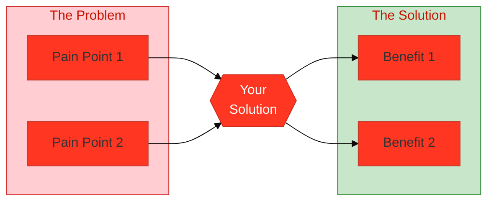
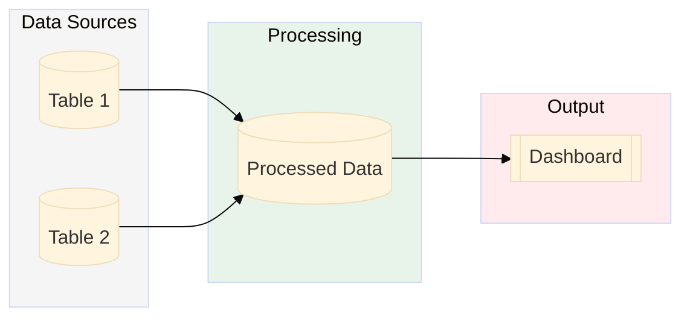
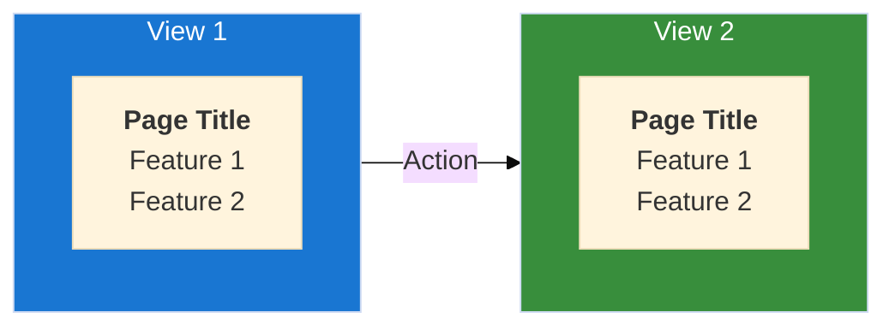
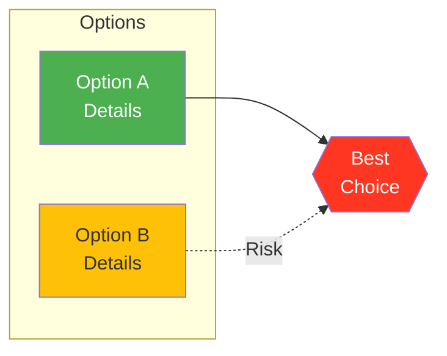

# Skill: Medium Article from Git Repo

Create professional Medium-style technical articles from GitHub repositories with diagrams and Google Docs integration.

## Overview

This skill transforms a GitHub repository with documentation into a polished Medium article with:
- Engaging hook and problem statement
- Multi-persona sections (Executive, Developer, Admin, etc.)
- Professional Mermaid diagrams
- Code snippets and SQL examples
- Proper image hosting on GitHub
- Google Docs publishing with embedded images

## Workflow Summary

```
1. Analyze repo documentation structure
2. Research successful article patterns
3. Write article in Markdown (source format, easy to edit/version)
4. Create Mermaid diagrams → PNG
5. Create GitHub Gists for all code blocks
6. Convert Markdown → HTML with Gist markers
7. Push images + HTML to GitHub repo
8. Enable GitHub Pages
9. Import HTML to Medium (markdown won't work!)
10. Replace Gist markers with embedded Gists
```

### File Outputs
| File | Purpose |
|------|---------|
| `MEDIUM_ARTICLE.md` | Source markdown (for editing/version control) |
| `MEDIUM_ARTICLE_MEDIUM_COMPATIBLE.md` | Tables → lists (Medium doesn't support tables) |
| `medium_article.html` | HTML for Medium import (includes Gist markers) |
| `medium_article_v1.html` | Version-stamped HTML (for cache busting if needed) |

**IMPORTANT:** Medium import only works with HTML via GitHub Pages. Markdown URLs do NOT work.

---

## Phase 1: Analyze Repository

### Fetch repo structure
```bash
# List docs folder
gh api repos/OWNER/REPO/contents/docs --jq '.[].name'

# Get README
gh api repos/OWNER/REPO/readme --jq '.content' | base64 -d

# Get specific doc file
gh api repos/OWNER/REPO/contents/docs/PATH.md --jq '.content' | base64 -d
```

### Key documentation to gather:
- README.md - Overview, quick start
- Executive summaries - Business value
- Technical references - Architecture, schemas
- Admin guides - Installation, operations
- User guides - How to use the solution

---

## Phase 2: Article Structure (Best Practices)

### Successful Medium Article Pattern

```markdown
# [Problem-Focused Title with Numbers/Impact]

*[Subtitle describing what reader will learn]*

---

## The [Problem] Nobody Talks About

[Personal story / relatable pain point - 2-3 paragraphs]
[Hook with specific numbers: "$125K problem", "3 months early"]


*Caption explaining the visual*

This article shows you how we solved this by building...

---

## What You'll Learn

| Section | For Whom | Time |
|---------|----------|------|
| Business Problem | Executives | 5 min |
| Installation | Administrators | 15 min |
| Deep Dive | Developers | 20 min |

---

## For Executives: The 2-Minute Summary

[Business-focused, no code, ROI examples]

| Without Solution | With Solution |
|------------------|---------------|
| Pain point 1 | Benefit 1 |
| Pain point 2 | Benefit 2 |

> **Executive Action Item:** [Specific next step]

---

## For Administrators: [Time] Installation

### Prerequisites
```sql
-- Verification queries
```

### One-Command Installation
```bash
# Step-by-step commands
```

> **Admin Action Item:** [Specific next step]

---

## For Developers: The [Technical Topic]

### Architecture

*Caption explaining data flow*

### Key Code Pattern
```sql
-- THE CORRECT WAY TO DO X
SELECT ...
```

**Common Mistake:** [What NOT to do]

---

## For FinOps: [Analysis Topic]


*Caption*

---

## Try It Yourself: 3 Paths

### Path 1: Quick (5 min)
### Path 2: Full Install (15 min)
### Path 3: Deep Dive

---

## Common Gotchas

### Gotcha 1: "[Error message]"
**Cause:** [Why it happens]
**Solution:** [How to fix]

---

## Resources

- **GitHub:** [repo-link]
- **Docs:** [official-docs]

---

## About the Author

*[Brief bio with credibility]*

---

**Did this help?** Give it a clap and follow for more.

*Tags: #Tag1 #Tag2 #Tag3*
```

---

## Phase 3: Create Mermaid Diagrams

### Install Mermaid CLI
```bash
npm install -g @mermaid-js/mermaid-cli
```

### CRITICAL: Line Breaks in Mermaid

**THIS IS THE #1 CAUSE OF BROKEN DIAGRAMS**

Mermaid does NOT interpret `\n` as line breaks - it renders them as literal text!

**WRONG - Shows literal \n as text:**
```mermaid
p1["Title\nSubtitle\nDetails"]
# Renders as: Title\nSubtitle\nDetails (broken!)
```

**CORRECT - Use HTML <br/> tags:**
```mermaid
p1["<b>Title</b><br/>Subtitle<br/>Details"]
# Renders as:
# Title
# Subtitle
# Details
```

**ALWAYS verify EVERY generated image visually before pushing to GitHub!**

### Post-Generation Verification (MANDATORY)

After generating ANY Mermaid diagram, ALWAYS:
1. Use the Read tool to view the PNG file
2. Check for literal `\n` text appearing in nodes
3. If found, fix the .mmd file by replacing `\n` with `<br/>`
4. Regenerate and verify again

```bash
# Quick check all images
for img in *.png; do echo "=== $img ==="; done
# Then use Read tool on each to visually verify
```

### Diagram Templates

#### 1. Problem-Solution Flow


#### 2. Architecture Diagram


#### 3. Dashboard/Navigation Pages


#### 4. Scenario Comparison


### Generate PNG from Mermaid
```bash
# Standard generation
mmdc -i diagram.mmd -o diagram.png -b white -w 1200 -H 400

# Recommended sizes by diagram type:
# - Architecture: -w 1200 -H 600
# - Problem/Solution: -w 1200 -H 400
# - Dashboard pages: -w 1400 -H 400
# - Scenario comparison: -w 1000 -H 500
```

---

## Phase 4: Push Images to GitHub

### Create images folder and push
```bash
# Clone repo
cd /tmp && git clone git@github.com:OWNER/REPO.git
cd REPO

# Create images folder
mkdir -p docs/images

# Copy images
cp /path/to/images/*.png docs/images/

# Commit and push
git add docs/images/*.png
git commit -m "Add article diagrams for documentation

- architecture.png: Data flow diagram
- problem_solution.png: Problem-to-impact visual
- dashboard_pages.png: Navigation overview

Co-Authored-By: Claude Opus 4.6 <noreply@anthropic.com>"

# If SSH fails, use HTTPS
git remote set-url origin https://github.com/OWNER/REPO.git
git push origin main
```

### Image URLs for Article
```
https://raw.githubusercontent.com/OWNER/REPO/main/docs/images/IMAGE.png
```

---

## Phase 5: Google Docs Integration

### Create/Update Google Doc

#### Read existing doc
```bash
TOKEN=$(gcloud auth application-default print-access-token)
DOC_ID="your-doc-id"
QUOTA_PROJECT="gcp-sandbox-field-eng"

curl -s "https://docs.googleapis.com/v1/documents/${DOC_ID}" \
  -H "Authorization: Bearer $TOKEN" \
  -H "x-goog-user-project: $QUOTA_PROJECT" | jq '.title'
```

#### Find image positions
```bash
curl -s "https://docs.googleapis.com/v1/documents/${DOC_ID}" \
  -H "Authorization: Bearer $TOKEN" \
  -H "x-goog-user-project: $QUOTA_PROJECT" | \
  jq '[.body.content[] | select(.paragraph?.elements[]?.inlineObjectElement) |
      {startIndex, imageId: .paragraph.elements[].inlineObjectElement.inlineObjectId}]'
```

#### Insert/Replace image from GitHub URL
```bash
IMAGE_URL="https://raw.githubusercontent.com/OWNER/REPO/main/docs/images/IMAGE.png"

# Delete old image at index and insert new one
curl -s -X POST "https://docs.googleapis.com/v1/documents/${DOC_ID}:batchUpdate" \
  -H "Authorization: Bearer $TOKEN" \
  -H "x-goog-user-project: $QUOTA_PROJECT" \
  -H "Content-Type: application/json" \
  -d "{
    \"requests\": [
      {
        \"deleteContentRange\": {
          \"range\": {\"startIndex\": INDEX, \"endIndex\": INDEX+1}
        }
      },
      {
        \"insertInlineImage\": {
          \"location\": {\"index\": INDEX},
          \"uri\": \"$IMAGE_URL\",
          \"objectSize\": {
            \"width\": {\"magnitude\": 500, \"unit\": \"PT\"},
            \"height\": {\"magnitude\": 200, \"unit\": \"PT\"}
          }
        }
      }
    ]
  }"
```

#### Force image refresh (cache busting)
```bash
TIMESTAMP=$(date +%s)
IMAGE_URL="https://raw.githubusercontent.com/OWNER/REPO/main/docs/images/IMAGE.png?v=${TIMESTAMP}"
```

#### Find text section by searching content
```bash
# Search for a section heading and get its index range
curl -s "https://docs.googleapis.com/v1/documents/${DOC_ID}" \
  -H "Authorization: Bearer $TOKEN" \
  -H "x-goog-user-project: $QUOTA_PROJECT" | \
  jq '[.body.content[] | select(.paragraph) | {startIndex, endIndex, text: [.paragraph.elements[]? | .textRun?.content // empty] | add}] | .[] | select(.text | contains("Section Name"))'
```

#### Delete a text section
```bash
# First find the start and end indices of the section to delete
# Then use deleteContentRange to remove it
curl -s -X POST "https://docs.googleapis.com/v1/documents/${DOC_ID}:batchUpdate" \
  -H "Authorization: Bearer $TOKEN" \
  -H "x-goog-user-project: $QUOTA_PROJECT" \
  -H "Content-Type: application/json" \
  -d '{
    "requests": [
      {
        "deleteContentRange": {
          "range": {
            "startIndex": START_INDEX,
            "endIndex": END_INDEX
          }
        }
      }
    ]
  }'
```

#### Get surrounding context to find exact range
```bash
# Get paragraphs in a range around a known index
curl -s "https://docs.googleapis.com/v1/documents/${DOC_ID}" \
  -H "Authorization: Bearer $TOKEN" \
  -H "x-goog-user-project: $QUOTA_PROJECT" | \
  jq '[.body.content[] | select(.paragraph) | {startIndex, endIndex, text: [.paragraph.elements[]? | .textRun?.content // empty] | add}] | .[] | select(.startIndex >= 13800 and .startIndex <= 14200)'
```

---

## Phase 6: Common Issues & Fixes

### Issue 1: Mermaid \n shows as literal text
**Fix:** Use `<br/>` instead of `\n` in node labels

### Issue 2: Image paths broken in GitHub
**Fix:** Use relative paths from article location:
- Article at `docs/ARTICLE.md`
- Images at `docs/images/`
- Use `images/filename.png` (not `medium_article_images/`)

### Issue 3: Google Doc images not updating
**Fix:** Add cache-busting query param: `?v=TIMESTAMP`

### Issue 4: SSH push denied to GitHub
**Fix:** Switch to HTTPS:
```bash
git remote set-url origin https://github.com/OWNER/REPO.git
```

### Issue 5: Image too small/large in Google Doc
**Fix:** Adjust objectSize in insertInlineImage:
```json
"objectSize": {
  "width": {"magnitude": 500, "unit": "PT"},
  "height": {"magnitude": 200, "unit": "PT"}
}
```

---

## Checklist

### Before Starting
- [ ] Clone/access the GitHub repo
- [ ] Identify key documentation files
- [ ] Determine target personas (Executive, Dev, Admin, etc.)

### Article Creation
- [ ] Write engaging hook with specific numbers
- [ ] Create "What You'll Learn" table
- [ ] Write persona-specific sections with action items
- [ ] Include code snippets with "Common Mistake" callouts
- [ ] Add "Try It Yourself" paths
- [ ] Add "Common Gotchas" section
- [ ] Include Resources and About Author

### Diagrams (VERIFY EACH ONE!)
- [ ] Create problem_solution.png
- [ ] Create architecture.png
- [ ] Create any persona-specific diagrams
- [ ] **Use `<br/>` for line breaks (NEVER `\n`)**
- [ ] **VISUALLY VERIFY EACH PNG** using Read tool
- [ ] Check for literal `\n` text in any node - if found, fix and regenerate
- [ ] Verify ALL images before pushing (don't assume one fix applies to all)

### Publishing
- [ ] Push images to `docs/images/` in repo
- [ ] Update article image paths to relative `images/`
- [ ] Push article to repo as `docs/MEDIUM_ARTICLE.md`
- [ ] Create/update Google Doc
- [ ] Insert images with GitHub raw URLs
- [ ] Verify all images display correctly

### Medium Publishing
- [ ] Create `MEDIUM_ARTICLE_MEDIUM_COMPATIBLE.md` (convert tables to lists)
- [ ] Update image URLs to absolute GitHub raw URLs
- [ ] Test import via https://medium.com/me/stories → Import
- [ ] Or use Medium API with integration token
- [ ] Review and publish

---

## File Locations

```
repo/
├── docs/
│   ├── MEDIUM_ARTICLE.md                    # Source markdown (for editing)
│   ├── MEDIUM_ARTICLE_MEDIUM_COMPATIBLE.md  # Tables → lists version
│   ├── medium_article.html                  # HTML for import (no markers)
│   ├── medium_article_v1.html  # HTML with Gist markers (USE THIS)
│   └── images/                              # All diagrams
│       ├── architecture.png
│       ├── problem_solution.png
│       ├── dashboard_pages.png
│       └── ...
```

Local working directory:
```
~/medium_article_images/     # Mermaid source files and PNGs
├── architecture.mmd
├── architecture.png
├── dashboard_pages.mmd
├── dashboard_pages.png
└── ...
```

---

## Example Command Sequence

```bash
# 1. Analyze repo
gh api repos/OWNER/REPO/contents/docs --jq '.[].name'

# 2. Create diagrams
cat > /tmp/arch.mmd << 'EOF'
flowchart LR
    A --> B --> C
EOF
mmdc -i /tmp/arch.mmd -o ~/medium_article_images/architecture.png -b white -w 1200

# 3. Write article (use Write tool or editor)

# 4. Push to GitHub
cd /tmp && git clone https://github.com/OWNER/REPO.git
mkdir -p REPO/docs/images
cp ~/medium_article_images/*.png REPO/docs/images/
cd REPO && git add . && git commit -m "Add article" && git push

# 5. Update Google Doc
TOKEN=$(gcloud auth application-default print-access-token)
# ... insert images via API
```

---

## Phase 7: Medium Compatibility

### What Medium Supports ✅

| Feature | Markdown Syntax | Medium Support |
|---------|-----------------|----------------|
| Bold | `**text**` | ✅ Yes |
| Italic | `*text*` | ✅ Yes |
| Headers | `#`, `##` | ✅ Yes (only 2 levels) |
| Links | `[text](url)` | ✅ Yes |
| Bullet lists | `* item` | ✅ Yes |
| Numbered lists | `1. item` | ✅ Yes |
| Code blocks | ``` | ✅ Yes (with syntax highlighting) |
| Inline code | `` ` `` | ✅ Yes |
| Images | `` | ✅ Yes (auto-loads from URLs) |
| Blockquotes | `>` | ✅ Yes |

### What Medium Does NOT Support ❌

| Feature | Issue |
|---------|-------|
| **Tables** (`\|---\|`) | ❌ Renders as plain text with `\|` characters |
| **Nested lists** | ⚠️ Limited/inconsistent support |
| **H3-H6 headers** | ⚠️ Only 2 heading levels exist (large T, small T) |
| **Horizontal rules** (`---`) | ⚠️ May not render correctly |
| **Strikethrough** (`~~text~~`) | ❌ Not supported |
| **Task lists** (`- [ ]`) | ❌ Not supported |
| **Numbered list continuity** | ⚠️ Cannot continue after section break or between images |

### Creating a Medium-Compatible Version

**ALWAYS create a separate `MEDIUM_ARTICLE_MEDIUM_COMPATIBLE.md` file** with tables converted to lists.

#### Table Conversion Patterns

**Pattern 1: Summary/Overview Tables → Bold Headers with Details**

Before (won't work):
```markdown
| Section | For Whom | Time |
|---------|----------|------|
| Business Problem | Executives | 5 min |
| Installation | Administrators | 15 min |
```

After (Medium-compatible):
```markdown
**The Business Problem** — For Executives, Finance — *5 min read*

**Quick Start Installation** — For Administrators — *15 min read*
```

**Pattern 2: Comparison Tables → Side-by-Side Sections**

Before (won't work):
```markdown
| Without Solution | With Solution |
|------------------|---------------|
| Problem 1 | Benefit 1 |
| Problem 2 | Benefit 2 |
```

After (Medium-compatible):
```markdown
**Without Solution:**
- Problem 1
- Problem 2

**With Solution:**
- Benefit 1
- Benefit 2
```

**Pattern 3: Feature/Component Tables → Bold Labels**

Before (won't work):
```markdown
| Component | Purpose |
|-----------|---------|
| Schema | `main.account_monitoring` |
| Tables | Contracts, burndown, forecasts |
```

After (Medium-compatible):
```markdown
**Unity Catalog Schema:** `main.account_monitoring`

**7 Delta Tables:** Contracts, burndown, forecasts, scenarios
```

**Pattern 4: Multi-Column Data → Structured Lists**

Before (won't work):
```markdown
| Commitment | 1 Year | 2 Year | 3 Year |
|------------|--------|--------|--------|
| $100K-250K | 10% | 12% | 15% |
| $250K-500K | 12% | 15% | 18% |
```

After (Medium-compatible):
```markdown
**$100K-250K commitment:**
- 1 Year: 10% discount
- 2 Year: 12% discount
- 3 Year: 15% discount

**$250K-500K commitment:**
- 1 Year: 12% discount
- 2 Year: 15% discount
- 3 Year: 18% discount
```

### Image URLs for Medium Import

**Use absolute GitHub raw URLs** (not relative paths) for Medium import:
```markdown

```

Medium will automatically download and host images from these URLs.

### Medium Import Process

**IMPORTANT:** Medium import does NOT work with raw GitHub markdown URLs. You must use GitHub Pages HTML.

#### Step 1: Create HTML Version
Create `docs/medium_article.html` with the article content as proper HTML (not markdown).

#### Step 2: Enable GitHub Pages
```bash
# Enable GitHub Pages from /docs folder
gh api repos/OWNER/REPO/pages -X POST --input - << 'EOF'
{
  "build_type": "legacy",
  "source": {
    "branch": "main",
    "path": "/docs"
  }
}
EOF
```

#### Step 3: Import to Medium
1. Sign in to Medium at https://medium.com
2. Go to: **https://medium.com/p/import**
3. Paste the GitHub Pages URL:
   ```
   https://OWNER.github.io/REPO/medium_article.html
   ```
4. Click **Import**
5. Click **"See your story"** to review the draft
6. Reformat images as needed (select images for layout options)
7. Publish

#### What Does NOT Work
- ❌ Raw GitHub markdown URLs (`raw.githubusercontent.com/.../file.md`)
- ❌ GitHub blob URLs (`github.com/.../blob/.../file.md`)

#### What Works
- ✅ GitHub Pages HTML (`owner.github.io/repo/file.html`)
- ✅ Any publicly accessible HTML web page

### Code Block Limitation & Gist Workaround

**CRITICAL:** Medium import collapses multi-line code blocks into single lines. All `<pre><code>` blocks lose their line breaks, making code unreadable.

**Symptoms after import:**
- Code appears as one long horizontal line
- Empty gray boxes appear below each code block
- SQL, Python, Bash all affected

**Solution: Use GitHub Gists**

1. **Create Gists for each code block:**
```bash
# Create a gist from a file
cat > /tmp/my_code.sql << 'EOF'
SELECT * FROM table
WHERE condition = true;
EOF
gh gist create /tmp/my_code.sql --public -d "Description of the code"
```

2. **In Medium editor:**
   - Delete the broken code block (single-line mess)
   - Delete the empty gray box below it
   - Press Enter to create a new line
   - Paste the Gist URL (e.g., `https://gist.github.com/USER/abc123`)
   - Medium auto-embeds with syntax highlighting

**Benefits of Gists:**
- ✅ Proper syntax highlighting (web)
- ✅ Line numbers
- ✅ Preserves all formatting
- ✅ Readers can star/fork the code
- ✅ You can update code without editing the article

### ⚠️ Mobile App Limitation

**Gists don't render reliably on Medium iOS/Android apps.** This is a Medium platform limitation.

**What happens on mobile:**
- Blank or partially rendered boxes
- Truncated code (only some lines visible)
- Raw URL shown as text if embed fails

**Root cause:** Medium uses Embedly for Gist embeds which relies on JavaScript. Mobile apps use native views/simplified webviews that don't execute these scripts consistently.

**Workarounds for mobile readers:**

1. **Hybrid approach (RECOMMENDED):** Use Gists for web + add fallback
   ```html
   <!-- CSS -->
   .mobile-fallback { font-style: italic; color: #666; font-size: 0.9em; margin-top: 0.5em; }

   <!-- Gist marker + embed + fallback -->
   <p class="gist-marker">GIST #1<br>https://gist.github.com/USER/ID</p>
   <script src="https://gist.github.com/USER/ID.js"></script>
   <p class="mobile-fallback">📱 On mobile? <a href="https://gist.github.com/USER/ID/raw">View raw code</a></p>
   ```

2. **Medium native code blocks:** For short, critical code snippets
   - Use Medium's backtick code block (renders as plain text everywhere)
   - Works on both web and mobile
   - No syntax highlighting, but guaranteed to display

3. **Always test on mobile** after publishing
   - Check iOS Medium app
   - Check Android Medium app
   - Adjust to native code blocks if Gists are broken

**Decision guide:**
| Code Type | Recommendation |
|-----------|----------------|
| Long SQL/Python (>10 lines) | Gist + fallback link |
| Short commands (<5 lines) | Medium native code block |
| Critical installation steps | Both: native block + Gist |

### Gist Marker Pattern for HTML (RECOMMENDED)

**Problem:** After Medium import, Gist `<script>` embeds become broken hyperlinks. Finding where to paste each Gist URL is tedious.

**Solution:** Add visible markers in the HTML that survive the import, making it easy to locate and replace each Gist.

#### HTML Version Header (for cache busting)
Add version tracking at the top of your HTML file:
```html
<!DOCTYPE html>
<!--
  Medium Article: [Title]
  Version: 1.0.0
  Last Updated: YYYY-MM-DD
  Features: Gist markers, mobile fallback links (/raw), reduced whitespace
-->
<html lang="en">
<head>
    <meta name="version" content="1.0.0">
    <meta name="last-updated" content="YYYY-MM-DD">
    ...
```
**Tip:** Increment version when re-importing to Medium to bypass cache issues.

#### CSS for Gist Markers and Mobile Fallback
Add this to your HTML `<style>` section:
```css
.gist-marker {
    background: #fff3cd;
    border: 2px dashed #ffc107;
    padding: 12px;
    border-radius: 5px;
    margin: 1em 0;
    font-family: monospace;
    font-size: 0.9em;
}
.mobile-fallback {
    font-style: italic;
    color: #666;
    font-size: 0.9em;
    margin-top: 0.5em;
}
```

#### HTML Pattern for Each Gist
Place marker **before** `<script>`, fallback link **after**:
```html
<p class="gist-marker">GIST #1<br>https://gist.github.com/USER/GIST_ID</p>
<script src="https://gist.github.com/USER/GIST_ID.js"></script>
<p class="mobile-fallback">📱 On mobile? <a href="https://gist.github.com/USER/GIST_ID">View raw code</a></p>
```

#### Example with Multiple Gists
```html
<h3>Prerequisites Checklist</h3>
<p>Run this in your SQL Editor:</p>

<p class="gist-marker">GIST #1<br>https://gist.github.com/USER/abc123</p>
<script src="https://gist.github.com/USER/abc123.js"></script>
<p class="mobile-fallback">📱 On mobile? <a href="https://gist.github.com/USER/abc123/raw">View raw code</a></p>

<h3>Installation Command</h3>

<p class="gist-marker">GIST #2<br>https://gist.github.com/USER/def456</p>
<script src="https://gist.github.com/USER/def456.js"></script>
<p class="mobile-fallback">📱 On mobile? <a href="https://gist.github.com/USER/def456/raw">View raw code</a></p>
```

#### Post-Import Workflow
1. Import the HTML via `https://medium.com/p/import`
2. In Medium editor, press **Cmd+F** and search for `GIST #`
3. For each marker found:
   - Select the entire yellow marker text
   - Delete it
   - Copy the Gist URL (without `.js`)
   - Paste on an empty line
   - Press Enter → Gist auto-embeds
4. Repeat for all markers

#### Key Points
- Use **base Gist URL** (no `.js` extension) when pasting in Medium
- URL must be **alone on its own line** for auto-embed to work
- Number your Gists (`GIST #1`, `GIST #2`) for easy tracking
- The marker text survives import as visible content you can search for

#### Known Medium Limitations (Cannot Be Fixed via HTML)

**Header Spacing:** Medium applies generous top/bottom margins to `<h2>` and `<h3>` elements. This is Medium's design choice and CANNOT be overridden via HTML/CSS.

**What Doesn't Work:**
- ❌ CSS margin adjustments (Medium ignores all imported CSS)
- ❌ Removing blank lines between HTML elements
- ❌ Replacing `<h3>` with `<p><strong>` (tested - no improvement)

**Solution:** Manual editing in Medium after import
1. Position cursor at the start of the extra whitespace
2. Delete the extra line breaks manually
3. Repeat for each header as needed

**Recommendation:** Keep proper HTML structure (`<h2>`, `<h3>`) in the source file for professional appearance in GitHub Pages. Accept that Medium import requires some manual spacing cleanup.

### Medium API (Alternative)

Use the API with an integration token if you prefer programmatic posting:

```bash
# Get your user ID
curl -s https://api.medium.com/v1/me \
  -H "Authorization: Bearer YOUR_TOKEN" | jq '.data.id'

# Create post as draft
curl -X POST "https://api.medium.com/v1/users/{userId}/posts" \
  -H "Authorization: Bearer YOUR_TOKEN" \
  -H "Content-Type: application/json" \
  -d '{
    "title": "Article Title",
    "contentFormat": "markdown",
    "content": "# Your markdown content...",
    "tags": ["Tag1", "Tag2", "Tag3"],
    "publishStatus": "draft"
  }'
```

**Integration tokens:** Generate at https://medium.com/me/settings → Security → Integration tokens

### Medium-Specific Checklist

**Before Import:**
- [ ] Create `MEDIUM_ARTICLE_MEDIUM_COMPATIBLE.md` version
- [ ] Convert ALL tables to bullet lists or bold sections
- [ ] Use absolute GitHub raw URLs for images in markdown
- [ ] Create GitHub Gists for ALL code blocks (`gh gist create`)
- [ ] Create `docs/medium_article.html` (HTML version for import)
- [ ] **Add Gist markers** (`GIST #1`, `GIST #2`, etc.) before each `<script src="gist...">` tag
- [ ] Enable GitHub Pages from `/docs` folder
- [ ] Wait for GitHub Pages to build (~30 seconds)

**Import & Fix:**
- [ ] Import via `https://OWNER.github.io/REPO/medium_article.html`
- [ ] Click "See your story" to review draft
- [ ] **Remove extra whitespace below headers** (Medium adds spacing - manual fix required)
- [ ] Search for `GIST #` (Cmd+F) to find all markers
- [ ] For each marker: delete it, paste Gist URL on empty line, press Enter
- [ ] Reformat images as needed (layout options)
- [ ] **Verify Resources section at end** (links sometimes don't import - copy/paste from HTML if missing)

**Publish:**
- [ ] Limit to 5 tags (25 chars max each)
- [ ] Add canonical URL if republishing
- [ ] Publish

**Post-Publish (Mobile Testing):**
- [ ] Test on iOS Medium app - check Gist rendering
- [ ] Test on Android Medium app - check Gist rendering
- [ ] If Gists broken on mobile, add fallback links or native code blocks

---

## Lessons Learned (From Real Debugging)

### Lesson 1: Verify ALL Images, Not Just One
When user reported `\n` issue in `dashboard_pages.png`, I fixed only that image.
Later discovered 3 more images had the same issue (`sweet_spot.png`, `architecture.png`, `problem_solution.png`).

**Rule:** When fixing a pattern issue, check ALL related files for the same problem.

### Lesson 2: Visual Verification is Non-Negotiable
The `\n` vs `<br/>` issue is invisible in the .mmd source file - it only appears in the rendered PNG.

**Rule:** ALWAYS use Read tool to view each generated PNG before pushing to GitHub.

### Lesson 3: GitHub Image Caching
After pushing updated images to GitHub, Google Docs may still show old cached versions.

**Fix:** Add cache-busting query parameter: `?v=TIMESTAMP`
```bash
TIMESTAMP=$(date +%s)
URL="https://raw.githubusercontent.com/.../image.png?v=${TIMESTAMP}"
```

### Lesson 4: Image Path Consistency
Article referenced `medium_article_images/` but images were pushed to `docs/images/`.

**Rule:** Decide on image folder location BEFORE writing the article, and verify paths match.

### Lesson 5: Keep Markdown and Google Doc in Sync
When editing the article (e.g., removing a section), update BOTH:
1. The markdown file in the GitHub repo
2. The Google Doc

**Workflow for section removal:**
1. Edit markdown file and commit/push to GitHub
2. Find section in Google Doc using text search (jq query with `.text | contains("Section Name")`)
3. Get surrounding context to find exact start/end indices
4. Use `deleteContentRange` API to remove the section
5. Verify the deletion by reading the doc again

**Rule:** Always update both sources to avoid drift between markdown and published doc.

### Lesson 6: Medium Header Spacing Cannot Be Fixed via HTML
Medium applies its own CSS styling after import, including generous margins around headers (`<h2>`, `<h3>`).

**What was tried (all failed):**
- Reducing CSS margins in HTML (Medium ignores imported CSS)
- Removing blank lines between HTML elements
- Replacing `<h3>` with `<p><strong>` (no improvement)

**What works:** Manual editing in Medium editor after import
- Position cursor in the whitespace below each header
- Delete the extra line breaks
- Takes ~2 minutes for a typical article

**Rule:** Keep professional HTML structure (proper h3 tags). Accept that Medium import requires manual spacing adjustment.

### Lesson 7: Resources Section May Not Import
The Resources/Links section at the end of articles sometimes fails to import properly. Links appear broken or missing entirely.

**Symptoms:**
- GitHub Repository link shows as plain text without URL
- External documentation links missing entirely
- Link text appears but not clickable

**Solution:** After import, scroll to the Resources section and verify all links work. If missing, copy/paste directly from the source HTML file.

**Rule:** Always verify the Resources section after Medium import.

### Lesson 8: Gist Embeds Don't Survive Medium Import
Medium import converts Gist `<script>` tags into broken hyperlinks, not embedded code blocks.

**Problem:** After import, you see `https://gist.github.com/USER/ID.js` as a clickable link instead of embedded code.

**Solution:** Add visible Gist markers in the HTML before each `<script>` tag:
```html
<p class="gist-marker">GIST #1 — DELETE THIS BLOCK AND PASTE URL ON EMPTY LINE:<br>https://gist.github.com/USER/GIST_ID</p>
```

**Post-Import Fix:**
1. Search for `GIST #` in Medium editor (Cmd+F)
2. Delete the marker text
3. Paste the Gist URL (without `.js`) on an empty line
4. Press Enter → auto-embeds

**Rule:** Always create HTML with Gist markers for easier post-import fixing.

---

## Reference Example

**ACME Workspace Usage Dashboard** - Complete example with all patterns applied:
- **GitHub Repo:** https://github.com/LaurentPRAT-DB/ACME_Workspace_Usage_Dashboard
- **HTML for Import:** https://laurentprat-db.github.io/ACME_Workspace_Usage_Dashboard/medium_article_v1.html
- **Medium Article (Draft):** https://medium.com/p/942713628fe7/edit

---

*Last updated: February 2026*
*Based on creating article for ACME_Workspace_Usage_Dashboard repo*
