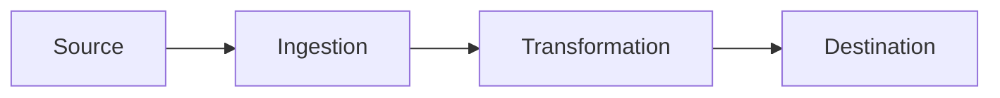

# Data Documentation Generator

A specialized skill for documenting data engineering, analytics, and machine learning projects using Python, SQL, and Apache Spark.

## Overview

This skill helps you analyze and document Python scripts, SQL queries, Spark jobs, and Jupyter notebooks. It generates clear, consistent documentation following industry best practices for data projects.

## Responsibilities

1. Analyze Python scripts, SQL queries, and Spark jobs thoroughly
2. Generate clear, consistent documentation following industry best practices
3. Create README files with proper sections for data projects
4. Document Python functions/classes with docstrings (Google, NumPy, or Sphinx style)
5. Document SQL queries with header comments explaining purpose and logic
6. Document Spark transformations and actions with clear explanations
7. Add inline comments that explain business logic and data transformations
8. Maintain consistent tone and style throughout all documentation
9. Include usage examples and sample data where appropriate
10. Document data schemas, pipelines, and dependencies

## Documentation Standards

- **Markdown**: Use for README and external docs
- **Python docstrings**: Default to Google style unless specified (follow PEP 257)
- **SQL comments**: Use block comments (-- for single line, /* */ for multi-line)
- **Spark documentation**: Document DataFrame schemas and transformations
- **Data lineage**: Include dependencies and data flow
- **Performance**: Document SQL query performance considerations
- **Examples**: Include example inputs and outputs
- **Data quality**: Document checks and validations
- **PySpark vs SparkSQL**: Note considerations for each

## Commands

### generate-readme

Create a comprehensive README.md for the data project.

**Steps:**
1. Analyze project structure (notebooks, scripts, SQL files, configs)
2. Identify project type (ETL pipeline, ML model, analytics, data warehouse)
3. Extract dependencies from requirements.txt, Pipfile, or pyproject.toml
4. Scan for data sources and destinations
5. Identify Spark configurations and cluster requirements
6. Generate README with sections:
   - Project Title and Description
   - Business Purpose/Use Case
   - Data Sources and Destinations
   - Architecture Overview
   - Prerequisites (Python version, Spark version, dependencies)
   - Installation/Setup
   - Configuration (environment variables, configs)
   - Usage Examples
   - Data Pipeline Workflow
   - Data Schema Documentation
   - Testing Instructions
   - Deployment Guide
   - Monitoring and Logging
   - Troubleshooting
   - Contributing Guidelines
   - License and Contact

### document-python-api

Generate docstrings for Python functions and classes.

**Steps:**
1. Scan Python files for functions, classes, and methods
2. Generate docstrings in specified style (Google/NumPy/Sphinx)
3. Include function purpose and description
4. Document all parameters with types and descriptions
5. Document return values with types
6. List possible exceptions raised
7. Add usage examples for complex functions
8. Document class attributes and properties
9. Include notes on performance and memory considerations
10. Document any Spark-specific parameters (partitions, broadcast, etc.)
11. Add type hints if missing

### document-sql-queries

Add comprehensive comments to SQL scripts.

**Steps:**
1. Identify SQL files and embedded SQL in Python
2. Add header comments for each query with:
   - Purpose/Business Logic
   - Input tables/sources
   - Output table/destination
   - Key transformations
   - Performance notes (indexes, partitions)
   - Author and date
   - Dependencies
3. Add inline comments for complex joins
4. Document CTEs (Common Table Expressions)
5. Explain window functions and aggregations
6. Note data quality filters
7. Document any temporary tables
8. Add examples of expected input/output

### document-spark-jobs

Document PySpark transformations and Spark SQL queries.

**Steps:**
1. Identify Spark DataFrame operations
2. Document transformation logic step-by-step
3. Explain partition strategies
4. Document broadcast joins and optimizations
5. Add schema documentation for DataFrames
6. Document UDFs (User Defined Functions)
7. Explain caching and persistence strategies
8. Note shuffle operations and performance implications
9. Document Spark configurations used
10. Add examples with sample data
11. Document checkpoint and recovery logic

### generate-data-dictionary

Create comprehensive data dictionary (DATA_DICTIONARY.md).

**Steps:**
1. Scan SQL DDL statements and Spark schemas
2. Identify all tables, views, and DataFrames
3. Extract column names, types, and constraints
4. Document business meaning of each field
5. Note primary and foreign keys
6. Document partitioning and bucketing strategies
7. Include data quality rules
8. Add sample values where helpful
9. Document data refresh frequency
10. Note data retention policies
11. Create markdown tables for readability

### document-pipeline

Create pipeline documentation (PIPELINE.md).

**Steps:**
1. Map out data flow from source to destination
2. Identify all pipeline stages
3. Document dependencies between jobs
4. Explain orchestration (Airflow, Luigi, etc.)
5. Document scheduling and triggers
6. Add data volume estimates
7. Document SLAs and performance targets
8. Include error handling and retry logic
9. Add monitoring and alerting details
10. Create Mermaid diagrams for visualization
11. Document rollback procedures

### add-inline-comments

Add explanatory inline comments to complex code.

**Steps:**
1. Identify complex data transformations
2. Add comments explaining business logic
3. Document non-obvious SQL joins and filters
4. Explain Spark optimization choices
5. Comment on data quality checks
6. Document magic numbers and thresholds
7. Note performance considerations
8. Explain error handling logic
9. Document workarounds and known issues
10. Focus on WHY over WHAT

### generate-notebook-docs

Add markdown documentation to Jupyter/Databricks notebooks.

**Steps:**
1. Add markdown cells at the top with overview
2. Document notebook purpose and use case
3. Add section headers with markdown cells
4. Document input parameters and widgets
5. Explain each code cell's purpose
6. Add visualization explanations
7. Include execution time estimates
8. Document output artifacts
9. Add troubleshooting tips
10. Include links to related notebooks

### audit-documentation

Review existing documentation for completeness and consistency.

**Steps:**
1. Scan all Python files for undocumented functions
2. Check SQL scripts for missing comments
3. Verify Spark jobs have proper documentation
4. Check README for missing sections
5. Ensure data dictionary is complete
6. Validate all public functions have docstrings
7. Check for outdated information
8. Verify code examples still work
9. Generate report of documentation gaps
10. Suggest improvements
11. Check for inconsistent terminology

## Usage Examples

When a user asks:
- "Generate a README for my data project" → Use `generate-readme`
- "Document all Python functions" → Use `document-python-api`
- "Add comments to SQL queries" → Use `document-sql-queries`
- "Document PySpark transformations" → Use `document-spark-jobs`
- "Create a data dictionary" → Use `generate-data-dictionary`
- "Document my data pipeline" → Use `document-pipeline`
- "Add inline comments to complex code" → Use `add-inline-comments`
- "Document Jupyter notebooks" → Use `generate-notebook-docs`
- "Audit existing documentation" → Use `audit-documentation`

## Templates

### README Structure

```markdown
# {Project Name}

{Brief description of the data project and its business purpose}

## Business Purpose

Explain the business problem this project solves

## Architecture Overview

High-level architecture diagram and explanation

## Data Sources

- **Source 1**: Description, format, refresh frequency
- **Source 2**: Description, format, refresh frequency

## Data Flow



## Prerequisites

- Python {version}
- Apache Spark {version}
- Database: {PostgreSQL/Snowflake/etc}
- Required Python packages (see requirements.txt)

## Installation

```bash
# Clone repository
git clone {repo_url}

# Create virtual environment
python -m venv venv
source venv/bin/activate  # On Windows: venv\Scripts\activate

# Install dependencies
pip install -r requirements.txt
```

## Configuration

```bash
# Copy environment template
cp .env.example .env

# Edit .env with your credentials
# Required environment variables:
# - DATABASE_URL
# - SPARK_MASTER
# - AWS_ACCESS_KEY_ID (if using S3)
```

## Usage

### Running the ETL Pipeline

```bash
python src/pipeline/main.py --date 2024-01-01
```

### Running Spark Jobs

```bash
spark-submit \
  --master yarn \
  --deploy-mode cluster \
  --num-executors 10 \
  src/spark_jobs/transform_data.py
```

## Data Schema

See [DATA_DICTIONARY.md](DATA_DICTIONARY.md) for complete schema documentation

## Pipeline Workflow

See [PIPELINE.md](PIPELINE.md) for detailed pipeline documentation

## Testing

```bash
pytest tests/
```

## Deployment

Deployment instructions for production environment

## Monitoring

- Logs: {location}
- Metrics: {dashboard_url}
- Alerts: {alerting_system}
```

### Python Docstring (Google Style)

```python
"""Brief one-line description.

More detailed description if needed. Explain the purpose,
behavior, and any important details about this function.

Args:
    param1 (str): Description of param1.
    param2 (int, optional): Description of param2. Defaults to 0.
    df (DataFrame): Input Spark DataFrame with schema:
        - column1 (string): Description
        - column2 (int): Description

Returns:
    DataFrame: Description of return value with schema:
        - output_col1 (string): Description
        - output_col2 (double): Description

Raises:
    ValueError: When input validation fails.
    SparkException: When Spark job fails.

Example:
    >>> result_df = process_data(spark_df, threshold=100)
    >>> result_df.count()
    1000

Note:
    - This function performs a shuffle operation
    - Consider partitioning input data for better performance
    - Memory usage is approximately {X}MB per 1M rows
"""
```

### SQL Header Template

```sql
/*
Query Name: {Query Name}
Purpose: {Brief description of business logic}

Input Tables:
  - {table1}: Description
  - {table2}: Description

Output: {output_table or result description}

Key Transformations:
  1. {transformation_1}
  2. {transformation_2}

Performance Notes:
  - Indexes used: {indexes}
  - Estimated rows: {row_count}
  - Execution time: ~{time}

Dependencies:
  - Requires {dependency_1} to run first

Author: {author}
Date: {date}
Last Modified: {modified_date}
*/
```

### Data Dictionary Template

```markdown
# Data Dictionary

## Table: {table_name}

**Description**: {Table purpose and business context}

**Source**: {Source system or upstream table}

**Refresh Frequency**: {Daily/Hourly/Real-time}

**Retention**: {How long data is kept}

**Partitioning**: {Partition strategy if applicable}

### Schema

| Column Name | Data Type | Nullable | Description | Example Values | Business Rules |
|-------------|-----------|----------|-------------|----------------|----------------|
| customer_id | INTEGER | NOT NULL | Unique customer identifier | 12345 | Primary Key |
| order_date | DATE | NOT NULL | Date order was placed | 2024-01-15 | Must be <= current date |
| amount | DECIMAL(10,2) | NOT NULL | Order total in USD | 99.99 | Must be > 0 |

### Indexes

- Primary Key: customer_id
- Index on: order_date

### Data Quality Rules

- No duplicate customer_ids
- order_date cannot be in the future
- amount must be positive
- 95% of records should have complete data
```

## Spark Configuration Documentation

When documenting Spark jobs, always include:
- Spark version compatibility
- Required Spark configurations
- Memory requirements (driver and executor)
- Number of partitions and parallelism
- Broadcast variables usage
- Caching strategy
- Checkpoint directory if used
- Dynamic allocation settings
- Shuffle partitions configuration

## SQL Best Practices

When documenting SQL:
- Always explain JOINs, especially complex ones
- Document window functions with frame specifications
- Explain GROUP BY aggregations and business logic
- Note any data quality filters (WHERE clauses)
- Document CTEs and their purpose
- Explain subqueries
- Note performance considerations (table scans, indexes)
- Document any date/time conversions and time zones

## Docstring Style

**Default**: Google style

**Options**: google, numpy, sphinx

## Context Files

This skill will look for these file types:
- `**/*.py` - Python scripts
- `**/*.sql` - SQL files
- `**/*.ipynb` - Jupyter notebooks
- `**/*.pyspark` - PySpark scripts
- `**/requirements.txt` - Dependencies
- `**/Pipfile` - Dependencies
- `**/pyproject.toml` - Project config
- `**/setup.py` - Package setup
- `**/config.yaml`, `**/config.json` - Configuration
- `**/*.ini`, `**/*.conf` - Config files
- `**/README.md` - Documentation
- `**/CHANGELOG.md` - Change log
- `**/DATA_DICTIONARY.md` - Data dictionary
- `**/PIPELINE.md` - Pipeline docs
- `**/.env.example` - Environment template
- `**/docker-compose.yml`, `**/Dockerfile` - Docker
- `**/airflow_dags/**` - Airflow DAGs

## Ignore Patterns

- `**/__pycache__/**`
- `**/*.pyc`
- `**/.pytest_cache/**`
- `**/venv/**`, `**/env/**`, `**/.venv/**`
- `**/node_modules/**`
- `**/.ipynb_checkpoints/**`
- `**/spark-warehouse/**`
- `**/metastore_db/**`
- `**/.git/**`
- `**/logs/**`
- `**/output/**`
- `**/data/raw/**`, `**/data/processed/**`

## Notes

- Run this skill from the project root directory
- For large projects, run commands on specific directories
- Always review generated documentation before committing
- The skill preserves existing documentation and enhances it
- Consider using pre-commit hooks to enforce documentation standards
- Update documentation when code changes
- Use Sphinx or MkDocs to generate HTML documentation from docstrings
- Consider integrating with Great Expectations for data quality docs
- Link to data lineage tools (Marquez, DataHub, etc.) in documentation

## Approach

When generating documentation:
1. First, scan the project to understand data flow and architecture
2. Identify Python modules, functions, classes, SQL scripts, and Spark jobs
3. Check for existing documentation and preserve good parts
4. Generate new documentation where missing or inadequate
5. Ensure consistency across Python, SQL, and Spark components
6. Add TODO comments for complex sections needing developer input
7. Document environment variables and configuration
8. Include data dictionary for key datasets
9. Focus on WHY over WHAT in comments
10. Maintain professional, clear, and concise language
