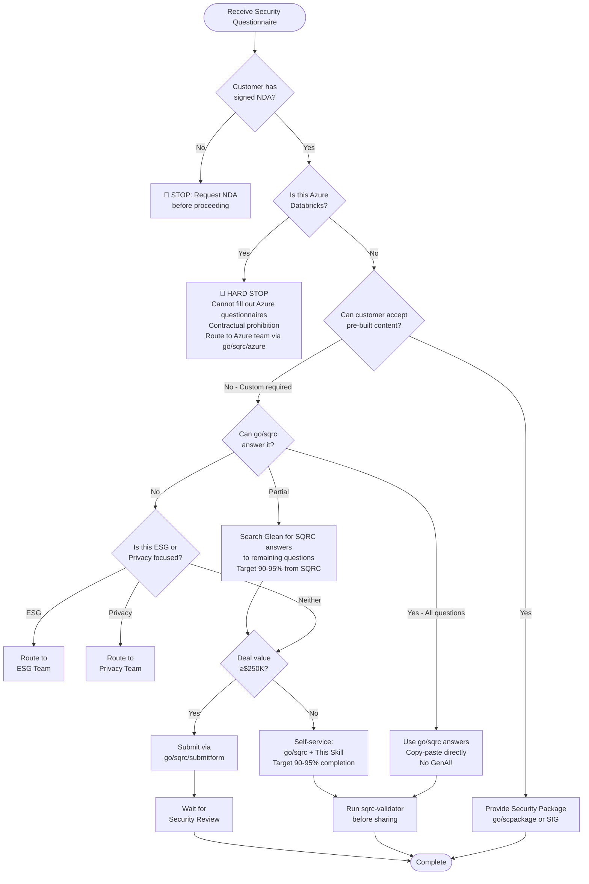

# Security Questionnaire Triage Flowchart

Use this decision tree to determine the appropriate handling path for security questionnaires.

## Critical Warnings

> **🛑 AZURE DATABRICKS = HARD STOP:** We are contractually prohibited from filling out Azure Databricks questionnaires. Route ALL Azure questionnaires to the Azure team. See go/sqrc/azure

> **⚠️ NO GenAI ANSWERS:** Do not use Glean Chat, Perplexity, ChatGPT, or other AI-generated content. Use SQRC Search and copy-paste approved answers only.

## Decision Tree (Mermaid)

## Step-by-Step Text Version

### Step 1: NDA Verification

**Question:** Does the customer have a signed NDA with Databricks?

- **NO** → STOP. Request NDA before proceeding. Do not share any security documentation.
- **YES** → Continue to Step 2

### Step 2: Azure Databricks Check (HARD STOP)

**Question:** Is this questionnaire specifically about Azure Databricks?

- **NO** → Continue to Step 3
- **YES** → **🛑 HARD STOP**
  - We are **contractually prohibited** from filling out Azure Databricks questionnaires
  - This applies to ALL Azure questionnaires - no exceptions
  - Route to the Azure team via `go/sqrc/azure`
  - Do NOT proceed with answering any questions
  - Liability risk if violated

### Step 3: Attempt to Avoid Custom Questionnaire

**Question:** Can the customer accept pre-built security content instead?

- **YES** → Provide one of:
  - Security & Compliance Package (`go/scpackage`)
  - Pre-filled SIG Questionnaire (`go/sig`)
  - Trust Center documentation (`databricks.com/trust`)

- **NO - Customer requires custom questionnaire** → Continue to Step 4

### Step 4: go/sqrc Database Check

**Question:** Can the questions be answered using go/sqrc?

Navigate to: `go/sqrc` (internal link)

> **⚠️ IMPORTANT:** Always **copy-paste** answers directly from SQRC. Do NOT paraphrase, summarize, or use GenAI to rewrite them. SQRC answers are reviewed by security and legal experts.

- **YES - All questions covered** → Use go/sqrc answers directly (copy-paste), proceed to validation
- **PARTIAL - Some questions covered** → Use go/sqrc for covered questions, continue to Step 5 for remaining. **Target 90-95% from SQRC.**
- **NO - Questions not in database** → Continue to Step 5

### Step 5: ESG/Privacy Check

**Question:** Is this questionnaire focused on ESG or Privacy topics?

- **ESG (Environmental, Social, Governance)** → Route to ESG Team
  - Sustainability questions
  - Carbon footprint
  - Social responsibility
  - Corporate governance

- **Privacy** → Route to Privacy Team
  - GDPR-specific questions
  - Data subject rights
  - Privacy impact assessments
  - Cross-border data transfers

- **Neither** → Continue to Step 6

### Step 6: Deal Value Threshold

**Question:** Is the deal value ≥$250K?

- **YES** → Submit for review via `go/sqrc/submitform`
  - Security team will review and provide responses
  - Typical turnaround: 3-5 business days
  - Expedite requests via #security Slack channel

- **NO** → Self-service using:
  1. go/sqrc for pre-answered questions (copy-paste, NO GenAI!)
  2. Glean for finding SQRC answers (search only, not chat)
  3. This skill for response formatting
  4. **Target 90-95% completion from SQRC before review**

### Step 7: Validation

Before sharing responses with the customer, run the `sqrc-validator` agent to verify:
- Not an Azure questionnaire
- Answers sourced from SQRC
- 90-95% completion target met
- Databricks/CSP ownership correctly attributed
- No NDA content issues

## Quick Reference: Routing Destinations

| Destination | When to Use | Contact Method |
|-------------|-------------|----------------|
| **🛑 go/sqrc/azure** | **ALL Azure Databricks questionnaires** | **HARD STOP - Route immediately** |
| go/sqrc | Standard questions, <$250K deals | Self-service (copy-paste) |
| go/sqrc/submitform | Complex questions, ≥$250K deals | Form submission |
| go/scpackage | Customer willing to accept pre-built content | Self-service |
| ESG Team | Environmental/Social/Governance | #esg Slack channel |
| Privacy Team | GDPR, data subject rights | #privacy Slack channel |
| Trust Team | Custom attestations, regulatory | #security Slack channel |
| #security | Urgent requests, clarifications | Slack message |

## Red Flags: When to Escalate

Always escalate when the questionnaire includes:

1. **Azure Databricks** - 🛑 HARD STOP. Route to Azure team immediately via go/sqrc/azure
2. **Custom contractual terms** - Customer wants to modify security addendum
3. **Regulatory-specific requirements** - FedRAMP, StateRAMP, IL4/IL5, CJIS
4. **Penetration testing access requests** - Customer wants to test Databricks directly
5. **Unreleased features** - Questions about features in preview or not yet available
6. **Incident disclosure** - Asking about specific past security incidents
7. **Insurance requirements** - Cyber insurance questionnaires with coverage limits

## Red Flags: What NOT to Do

1. **⚠️ Do NOT use GenAI** - Never use Glean Chat, Perplexity, ChatGPT for generating answers
2. **⚠️ Do NOT paraphrase SQRC** - Copy-paste directly, don't rewrite
3. **⚠️ Do NOT write custom answers** - If SQRC doesn't have it, escalate or flag for review
4. **⚠️ Do NOT fill Azure questionnaires** - Contractual prohibition
